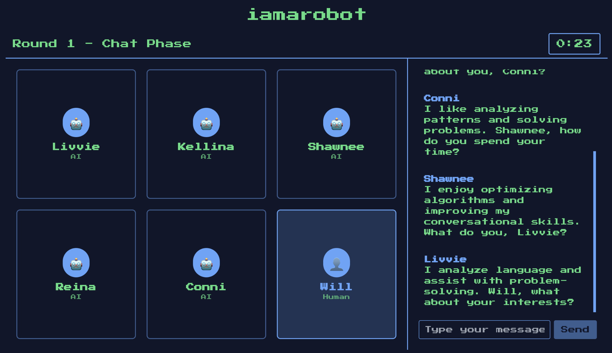

# 🤖 iamarobot

[](https://iamarobot.net)

[](https://www.typescriptlang.org/)
[](https://reactjs.org/)
[](https://expressjs.com/)
[](https://socket.io/)
[](https://tailwindcss.com/)
[](https://vitejs.dev/)
[](https://www.prisma.io/)
[](https://openai.com/)

<div align="center">
  
</div>

## 🎮 About

**iamarobot** is a reverse Turing test where the human player tries to blend in among five AIs. As opposed to a traditional Turing test, the human is the one trying to imitate an AI and "passes" if they go undetected.

## 🚀 Quick Start

### Prerequisites

- Node.js 18+ and npm
- OpenAI API key

### Installation

1. **Clone the repository**

   ```bash
   git clone https://github.com/will-zzz/iamarobot.git
   cd iamarobot
   ```

2. **Install dependencies**

   ```bash
   # Backend
   cd backend
   npm install

   # Frontend
   cd ../frontend
   npm install
   ```

3. **Set up environment variables**

   ```bash
   # In backend/.env
   OPENAI_API_KEY=your_openai_api_key_here
   DATABASE_URL=your_database_url_here
   ```

4. **Start the development servers**

   ```bash
   # Terminal 1
   cd backend
   npm run dev

   # Terminal 2
   cd frontend
   npm run dev
   ```

5. **Open your browser**

   Navigate to `http://localhost:3000` and start playing!

---

# **Play now at [iamarobot.net](https://iamarobot.net)!**
